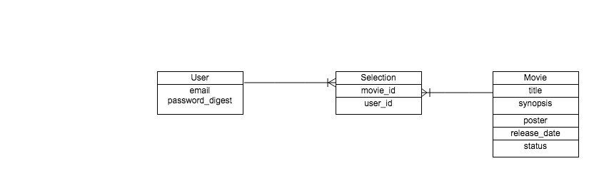

###Project 3 - Git Reel

###GA WDI DC November 2014 

**Overview**

Git Reel makes it easy for anyone to browse trailers of movies currently in theaters, or coming soon, then save their release dates and get a friendly reminder when the dates are approaching. 

**Technologies Used**

- Ruby 2.1.2
- Ruby on Rails 4.1.1
- Javascript (JQuery, Ajax)
- PostgreSQL Database
- User authentication & authorization from Devise gem
- Testing using rspec-rails, capybara, shoulda-matchers and factory_girl_rails
- CSS styling using SASS
- Rotten Tomatoes, Fandango, Mapbox && Youtube APIs

**User Stories Completed** 

- User can choose to not sign in and still browse trailers currently in theaters
- User can sign up / sign in
- User can browse and play trailers of movies that are in theaters or coming soon
- User can add reminder to their google calendar for movies currently playing / comming soon
- User can save movies that are coming soon
- User can find theaters in her area
- User gets redirected to the theater page when he clicks on the theater's map marker

**ERD**

**What's next?**
- Reminder for DVD release date
- Rake task to update movie DVD release date when it is changed on API
- Styling and making it more user friendly
- Testing
- Refactoring
- Deploying

Set up
  
    rake db:create
    rake db:migrate
 
